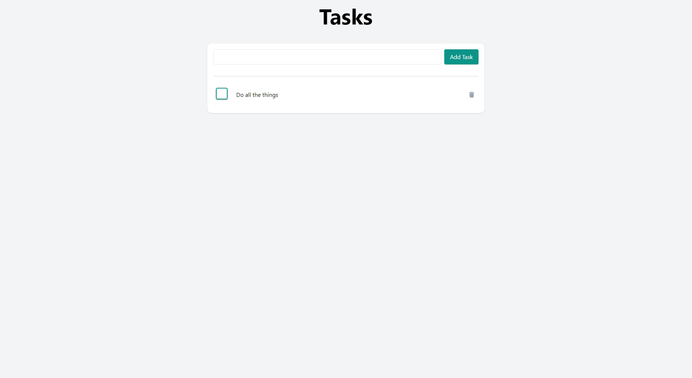

# Todo App

[https://rb-todo-app.herokuapp.com/](Here)

## What?

A nice & simple full stack application created in Go and Vue.

## Why?

I wanted to make a nice simple application just to get a project deployed. I also wanted to make an API with Go so seemed like a decent thing to do.

## How?

I used [gofiber](https://gofiber.io/) to create the API because I'm already familiar with Node.JS and Express. 

Data is persisted in PostgreSQL because I fancied a change from MongoDB. 

## Screenshots

